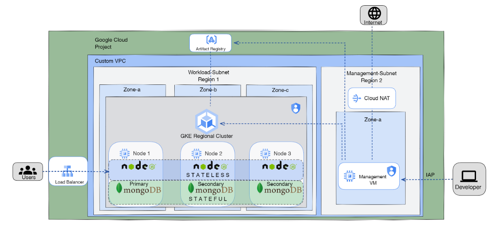

# Infrastructure as a Code (IAC) in GCP ☁️

This project showcases the power of Infrastructure as Code (IAC) through Terraform, enabling the creation of GCP ☁️ Infrastructure:

## The project encompasses the following components:

- Terraform Infrastructure: Develop and utilize custom Terraform modules to construct the necessary infrastructure on Google Cloud Platform, including IAM setup, network configuration (VPC, subnets, firewall rules, NAT), compute resources (private VM, GKE standard cluster spanning three zones), and storage through the Artifact Registry.

- MongoDB Deployment: Implement a MongoDB replica set across three distinct zones, ensuring high availability and data redundancy.

- Containerization with Docker: Dockerize the Node.js web application, enabling it to seamlessly connect with the three MongoDB replicas.

- Exposure via Ingress and Load Balancer: Expose the web application using an ingress controller and load balancer, ensuring accessibility and distribution of traffic.



## 🚀 Getting Started

### Prerequisites  🛠️

Before you begin, ensure you have the following installed:

- Terraform 🏗️
- Google Cloud SDK ☁️
- Docker  🐋
- Kubectl ☸

### Install The Google Cloud SDK ☁️.

1. Open a terminal window.
2. Run the following command:
   
  ```
  sudo apt-get install google-cloud-sdk-gke-gcloud-auth-plugin
  ```
3. Then you will need to configure your account and select your project, for this you will use the following command:

  ```
  gcloud auth login
  ```
4. you will be prompted to enter the project id.
> [!NOTE]
> you can get the project id by going to the GCP console and in the dashboard you will find the project id
> The chosen project will be the default project for all the gcloud commands till changed

---- 🌟 ----

### Clone this repository to your local environment to start setting up the infrastructure.

Run the following command:
  ```
  git clone https://github.com/Hendawyy/Project_GCP_iTi.git
  cd Project_GCP_iTi
  ```

---- 🌟 ----

### Now We Can Get to The Terraform

To be able to use the GCP from the terraform you will have to
1. Create a service account for this we can do it using the GCP console or the gcloud commands
   GCP console:
    1. Navigate to the IAM
    2. Then find Service Accounts
    3. Create A service account
    4. Give this account the editor role
    5. inside this service account find keys
    6. Add Key
    7. Choose JSON format
    8. After adding the key it will be downloaded automatically
    9. Copy this key to your project directory
    10. Create a directory called "Secrets"
    11. Copy your key to this directory
   gcloud Commands
    1. First we create the Svc Account & Add The role
       ```
       gcloud iam service-accounts create SERVICE_ACCOUNT_NAME --display-name "DISPLAY_NAME"
       gcloud projects add-iam-policy-binding YOUR_PROJECT_ID --member=serviceAccount:SERVICE_ACCOUNT_EMAIL --role=roles/editor
       ```
    2. Then We Create the Key
        ```
        gcloud iam service-accounts keys create KEY_FILE.json --iam-account SERVICE_ACCOUNT_EMAIL
        ```
    3. Copy this key to your project directory
    4. Create a directory called "Secrets"
    5. Copy your key to this directory

2. Then we add this key path inside our terraform variables and we can use it freely inside our terraform configurations
3. Now You Can run the Terraform configuration files
   ```
    cd Terraform\
    terraform init
    terraform plan
    terrafrom apply
    ```

> [!NOTE]
> The ``` terraform apply ``` command might take up to 15 mins to finish executing


---- 🌟 ----

### Now We Can Get to The Terraform


## Questions or Need Help?

If you have any questions, suggestions, or need assistance, please don't hesitate to Contact Me [Seif Hendawy](mailto:seifhendawy1@gmail.com). 😉

